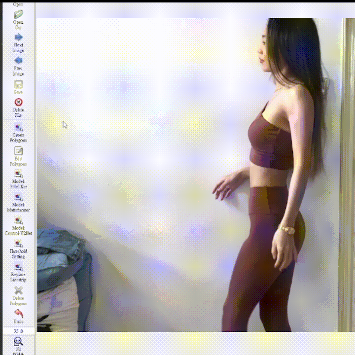
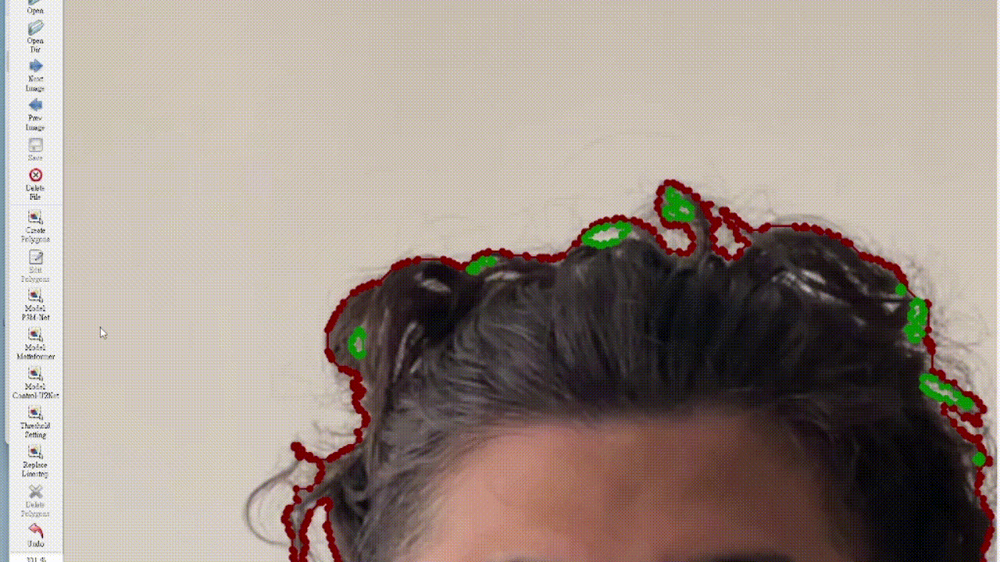
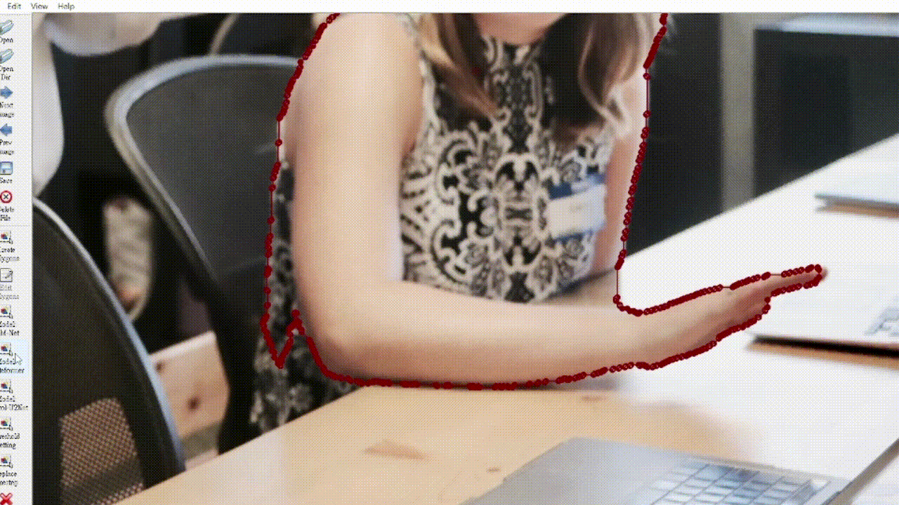

<h1 align="center">
  <br/>HS-Labelme
</h1>

<br/>

## Description

HS-Labelme is a graphical image annotation tool based on [labelme](https://github.com/wkentaro/labelme). It supports some AI-assisted labeling features for human segmentation. All the functions support Undo with Ctrl+Z. It is written in Python and uses Qt for its graphical interface.
<br /> 

<i>The first function "Model: P3M-Net" can label the human automatically.<br /></i>
   
<br /> 
<i>The second function "Model: MatteFormer" can label different objects after the user draws trimaps. After drawing the gray part, right click the center area to fill it with white color.</i>
<br /> 
  
<br /> 
<i>The third function "Threshold Setting" can adjust the labeling boundary after using the first or second functions.</i>
  
<br /> 
<i>The fourth function "Replace Linestrip" can correct the labeling. Press Enter to confirm the corrected part.</i>
  

## Features

- [x] Auto-contouring for human segmentation
- [x] Video annotation.
- [x] GUI customization (predefined labels / flags, auto-saving, label validation, etc). ([#144](https://github.com/wkentaro/labelme/pull/144))
- [x] Exporting VOC-format dataset for semantic/instance segmentation.
- [x] Exporting COCO-format dataset for instance segmentation.

## Requirements

- Ubuntu / macOS / Windows
- Python3.7/3.8/3.9/3.10
- PyQt5

## Installation

```bash
git clone https://github.com/worree133/Labelme-for-Auto-Human-Segmentation.git
cd Labelme-for-Auto-Human-Segmentation
python setup.py build
pip install .
```
Download the pretrained model from [P3M-Net](https://drive.google.com/uc?export=download&id=1smX2YQGIpzKbfwDYHAwete00a_YMwoG1) and [MatteFormer](https://drive.google.com/file/d/1AU7uM1dtYjEhtOa_9OGfoQUE-tmW9mX5/view?usp=sharing).

Put the pretrained models to models/pretrained_models/

Create a info.txt in your current working directory to decide the label name.

In the info.txt, just type the label name of background in the first row and label name of foreground in the second row.

The sample info.txt can be checked in the source code.

## Usage

Run `hs_labelme --help` for detail.  
The annotations are saved as a [JSON](http://www.json.org/) file.

```bash
hs_labelme  # just open gui
```

## Acknowledgement

This repo is the fork of [wkentaro/labelme](https://github.com/wkentaro/labelme).
The models used are from:
- P3M-Net [JizhiziLi/P3M](https://github.com/JizhiziLi/P3M/tree/master/core)
- MatteFormer [webtoon/matteformer](https://github.com/webtoon/matteformer)
- U2Net [xuebinqin/U-2-Net](https://github.com/xuebinqin/U-2-Net)
